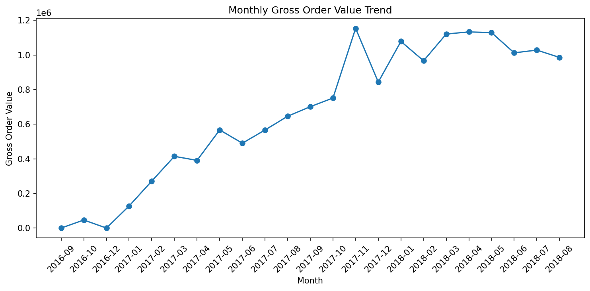
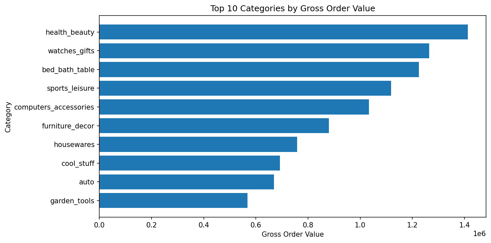
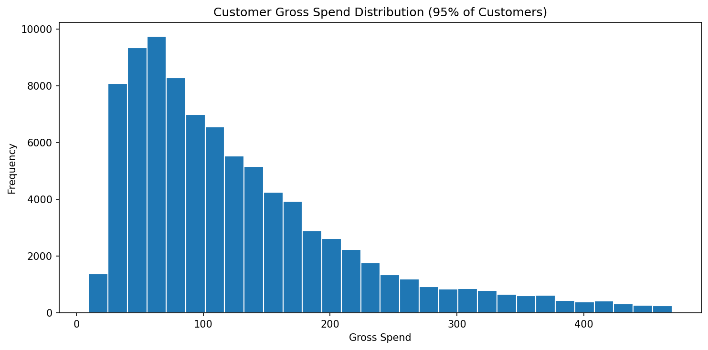

# E-commerce Sales Analysis

## Project Overview

This project analyzes transactional e-commerce data from the Brazilian Olist marketplace dataset using SQL and Python/Pandas.

The goal is to answer business questions about revenue performance, customer behavior, product/category concentration, and growth opportunities while documenting the data quality checks and assumptions used to make the analysis reliable.

This is an exploratory KPI analysis focused on data cleaning, validation, aggregation, visualization, and business interpretation.

## Business Questions

- How much product revenue, freight revenue, and gross order value were generated by delivered orders?
- How do gross order value and order volume evolve over time?
- Which product categories and products generate the most value?
- How concentrated is revenue across categories and customers?
- What percentage of customers make repeat purchases?
- Which data quality issues affect the analysis?

## Dataset

The analysis uses selected tables from the [Brazilian E-Commerce Public Dataset by Olist](https://www.kaggle.com/datasets/olistbr/brazilian-ecommerce).

Tables used:

- `orders`
- `order_items`
- `products`
- `customers`
- `product_category_name_translation`

Main relationship used:

```text
customers -> orders -> order_items -> products -> product_category_name_translation
```

## Tools

- MySQL
- SQL
- Python
- Pandas
- Matplotlib
- Jupyter Notebook

## Repository Structure

```text
ecommerce-sales-analysis/
|-- README.md
|-- requirements.txt
|-- data/
|   `-- raw/
|       |-- olist_customers_dataset.csv
|       |-- olist_orders_dataset.csv
|       |-- olist_order_items_dataset.csv
|       |-- olist_products_dataset.csv
|       `-- product_category_name_translation.csv
|-- pandas_analysis/
|   |-- 01_pandas_analysis.ipynb
|   |-- outputs/
|   `-- README.md
`-- sql_analysis/
    |-- 00_data_cleaning.sql
    |-- 01_basic.sql
    |-- 02_intermediate.sql
    |-- 03_advanced.sql
    |-- 04_KPI_metrics.sql
    `-- README.md
```

## Analytical Approach

The project is split into two complementary parts:

- SQL is used for data cleaning, validation, KPI calculation, joins, aggregations, CTEs, and window functions.
- Pandas is used for exploratory analysis, validation checks, feature engineering, visualizations, and business interpretation.

Only delivered orders are used for revenue and business performance metrics because canceled or unavailable orders do not represent completed transactions.

Revenue is split into two definitions:

```text
product_revenue = price
freight_revenue = freight_value
gross_order_value = price + freight_value
```

This distinction avoids overstating product revenue while still preserving the total customer-paid value.

## Key Metrics

- Delivered orders: `96,478`
- Delivered item rows: `110,197`
- Product revenue: `13,221,498.11`
- Freight revenue: `2,198,275.64`
- Gross order value: `15,419,773.75`
- Product AOV: `137.04`
- Gross AOV: `159.83`
- Top 5 category gross order value share: `39.25%`
- Top 10 category gross order value share: `62.38%`
- One-time customer share: `97.0%`
- Repeat customer share: `3.0%`

## Key Findings

Delivered orders generated `13,221,498.11` in product revenue and `2,198,275.64` in freight revenue, for a gross order value of `15,419,773.75`.

Gross order value is concentrated in a limited number of product categories. The top 10 categories account for `62.38%` of delivered gross order value, with `health_beauty`, `watches_gifts`, and `bed_bath_table` among the highest-performing categories.

Customer retention appears to be a major opportunity. Only `3.0%` of customers placed more than one delivered order, suggesting that the business depends heavily on one-time buyers.

Customer spend is highly skewed. A small number of customers generate very high total spend, while most customers spend relatively modest amounts.

The dataset contains data quality limitations that affect modeling decisions. The raw CSVs have no duplicate primary keys in the core tables, but `610` products have no category and `2` category names have no English translation. These issues are preserved and handled with `LEFT JOIN` and `Unknown` category logic instead of dropping transactional records.

## Visual Summary

### Monthly Gross Order Value



### Top Categories



### Customer Spend Distribution



## Data Quality & Validation

The analysis includes validation steps inspired by QA practices:

- checking primary key uniqueness
- checking duplicate rows
- validating missing values
- converting text date columns to datetime types
- identifying invalid or blank date values
- validating unmatched product IDs across tables
- identifying missing category translations
- filtering only completed/delivered orders for revenue metrics
- using `customer_unique_id` for customer-level analysis instead of order-level `customer_id`

These checks are documented in SQL and mirrored in the Pandas workflow.

### Data Quality Summary

| Check | Result | Analysis decision |
| --- | ---: | --- |
| Duplicate `order_id` values | `0` | Use `order_id` as the order grain. |
| Duplicate `customer_id` values | `0` | Use `customer_id` for joins. |
| Repeated `customer_unique_id` values | `3,345` | Use `customer_unique_id` for customer-level analysis. |
| Duplicate `product_id` values | `0` | Use `product_id` for product/category joins. |
| Unmatched product IDs in `order_items` | `0` | No product transactions are lost in product joins. |
| Product categories without English translation | `2` | Group missing translations as `Unknown`. |
| Products without category | `610` | Keep transactions and group as `Unknown`. |
| Negative price rows | `0` | No adjustment needed. |
| Negative freight rows | `0` | No adjustment needed. |

## SQL/Pandas Reconciliation

These metrics are calculated in both SQL and Pandas to confirm that joins, filters, and metric definitions are consistent.

| Metric | Expected value |
| --- | ---: |
| Delivered item rows | `110,197` |
| Delivered orders | `96,478` |
| Product revenue | `13,221,498.11` |
| Freight revenue | `2,198,275.64` |
| Gross order value | `15,419,773.75` |
| Product AOV | `137.04` |
| Gross AOV | `159.83` |

## How To Run

### SQL

1. Create a MySQL database named `ecommerce`.
2. Import the raw CSV files into tables with matching names.
3. Run the SQL files in this order:

```text
00_data_cleaning.sql
01_basic.sql
02_intermediate.sql
03_advanced.sql
04_KPI_metrics.sql
```

### Pandas

1. Open `pandas_analysis/01_pandas_analysis.ipynb`.
2. Run all cells from top to bottom.
3. The notebook expects the raw CSV files to be available under `data/raw/`.

Python dependencies are listed in `requirements.txt`.

## Limitations

- Payments and reviews are not included in this version.
- Product revenue and freight revenue are separated, but taxes, discounts, and payment behavior are not included.
- Some early and late months may contain partial data and should be interpreted carefully in trend analysis.
- The dataset is historical and should not be interpreted as current marketplace performance.
- Category growth percentages should be interpreted carefully for low-volume categories because small absolute changes can produce large percentage changes.

## Possible Next Steps

- Add cohort or retention analysis.
