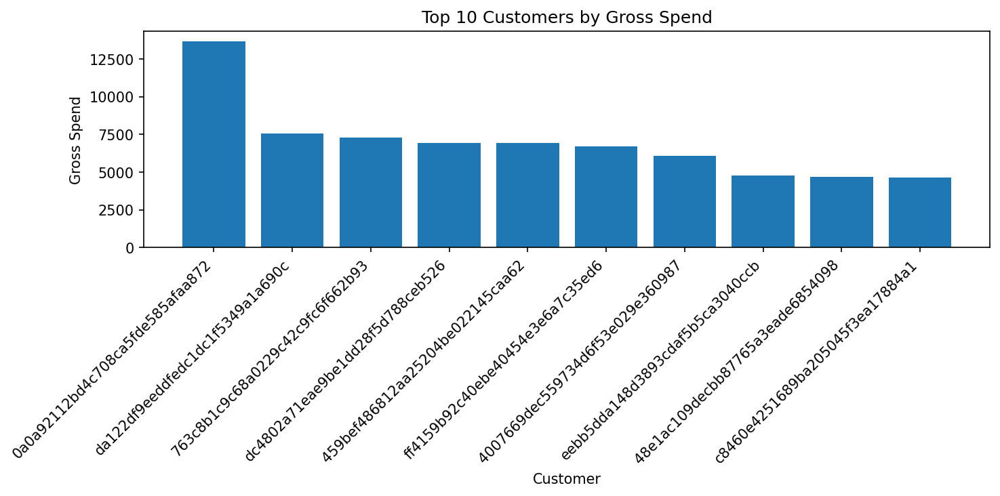
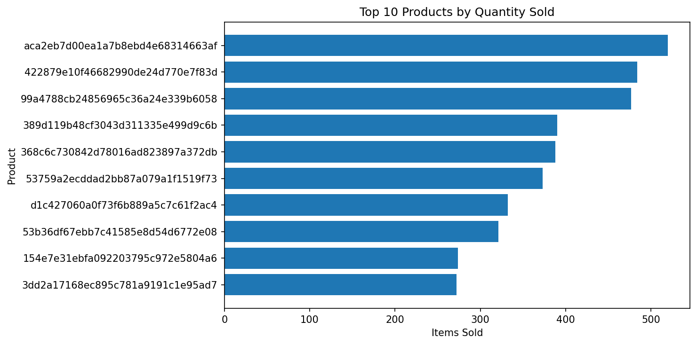

# E-commerce Sales Analysis with Pandas

## Project Overview

This project analyzes a real-world e-commerce dataset using Python and Pandas to explore sales trends, customer behavior, and product performance.

The analysis follows a complete data analysis workflow including:
- data loading
- cleaning and validation
- feature engineering
- exploratory analysis
- business-oriented visualizations

The goal is to simulate a realistic business analysis process and demonstrate practical data analyst skills.

---

## Objective

The main objective of this project is to answer key business questions such as:
- How has gross order value evolved over time?
- Which product categories generate the most gross order value?
- How is customer spending distributed?
- Who are the highest-value customers?
- Which products sell the most?

---

## Dataset

This analysis uses the Brazilian E-Commerce Public Dataset by Olist, containing transactional information from an online marketplace.

Main tables used:
- orders
- order_items
- products
- customers

---

## Tools & Libraries

- Python
- Pandas
- Matplotlib
- Jupyter Notebook

---

## Data Preparation Process

The dataset was prepared through several preprocessing steps:
- Converted imported text date columns to datetime format
- Validated primary key uniqueness
- Checked missing/null values
- Filtered analysis to delivered/completed orders only
- Created derived business metrics for analysis
- Built consolidated analytical dataset via table merges

---

## Key Analysis Performed

### Monthly Gross Order Value Trend

Analyzed gross order value evolution over time and month-over-month growth.

### Gross Order Value by Category

Identified highest-performing product categories by gross order value.

### Customer Spend Distribution

Examined customer purchasing behavior and spending concentration.

### Top Customers Analysis

Ranked customers by total spend and purchase frequency.

### Top Products Analysis

Measured best-selling products by quantity sold.

---

## Visualizations

The notebook exports the main charts to `pandas_analysis/outputs/` so they can be viewed directly from GitHub.

### Monthly Gross Order Value


### Top 10 Categories by Gross Order Value


### Customer Gross Spend Distribution


### Top 10 Customers by Gross Spend



### Top 10 Products by Quantity Sold



---

## Key Findings

- Delivered orders generated `13,221,498.11` in product revenue and `2,198,275.64` in freight revenue, for a gross order value of `15,419,773.75`.
- Gross AOV is `159.83`, while product-only AOV is `137.04`.
- Gross order value is concentrated by category: the top 5 categories account for `39.25%` and the top 10 account for `62.38%`.
- Customer behavior is acquisition-heavy: `97.0%` of customers placed only one delivered order and `3.0%` placed more than one.
- Customer spending is heavily right-skewed, with most customers spending modest amounts while a small number of customers represent high-value outliers.
- Sales volume is concentrated among a small number of high-performing products.

---

## Data Quality & Reconciliation

The notebook includes a data quality summary that connects each validation check to its analytical decision.

Key checks:

- `0` duplicate `order_id` values
- `0` duplicate `customer_id` values
- `3,345` repeated `customer_unique_id` values, which confirms that customer-level analysis should use `customer_unique_id`
- `0` unmatched product IDs in `order_items`
- `2` product categories without English translation
- `610` products without category
- `0` negative price rows
- `0` negative freight rows

The notebook also includes a SQL/Pandas reconciliation table for delivered item rows, delivered orders, product revenue, freight revenue, gross order value, product AOV, and gross AOV.

---

## Files Included

```text
01_pandas_analysis.ipynb -> Full notebook analysis
outputs/                  -> Exported chart images
README.md                -> Project summary and documentation
```

---

## Skills Demonstrated

This project showcases:
- Data Cleaning
- Exploratory Data Analysis (EDA)
- Data Validation
- Feature Engineering
- Business KPI Analysis
- Data Visualization
- Analytical Storytelling
